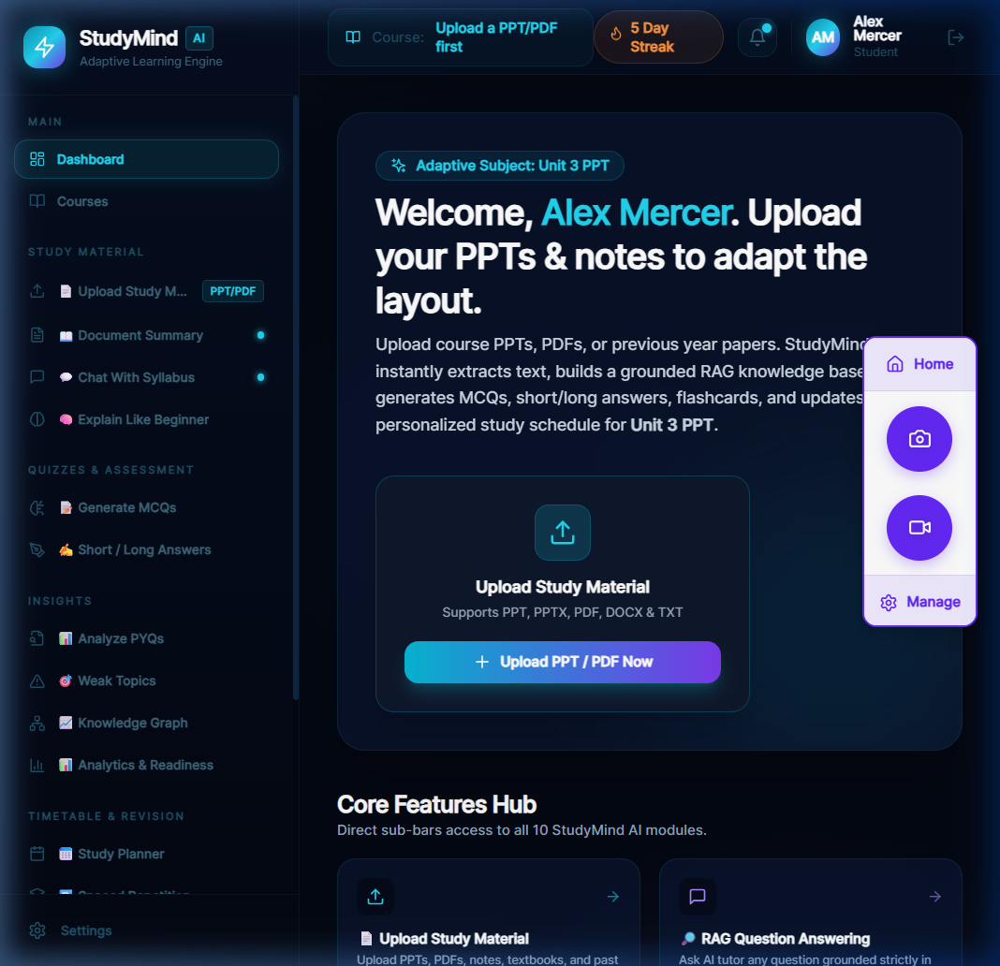
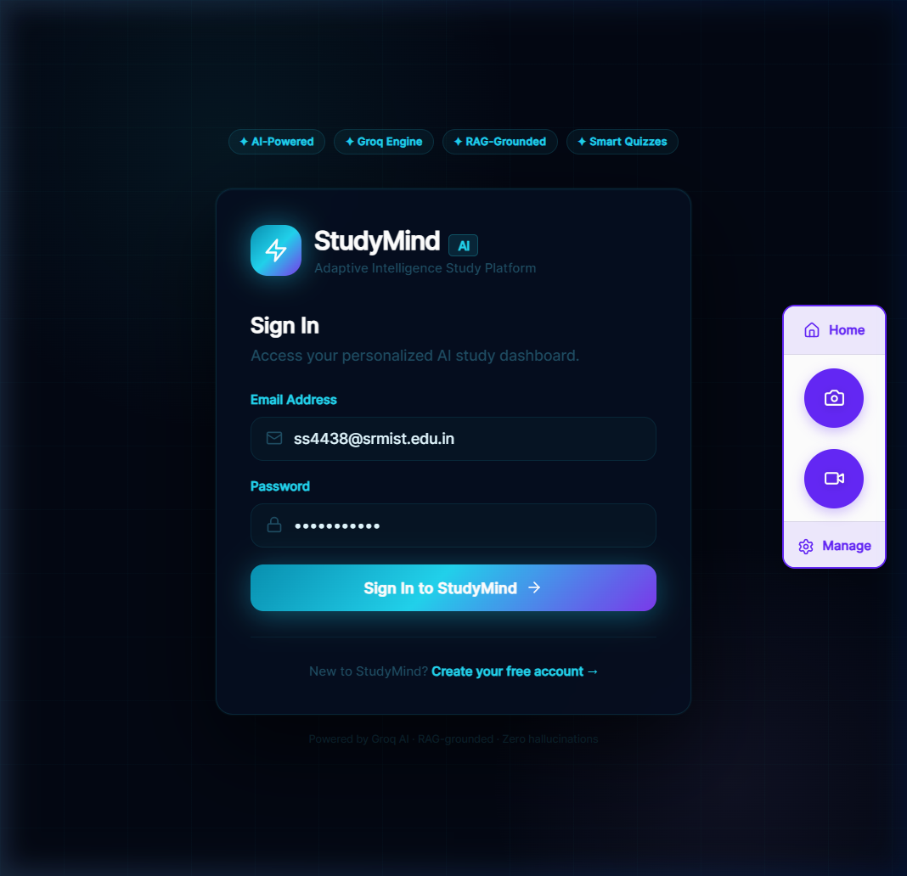
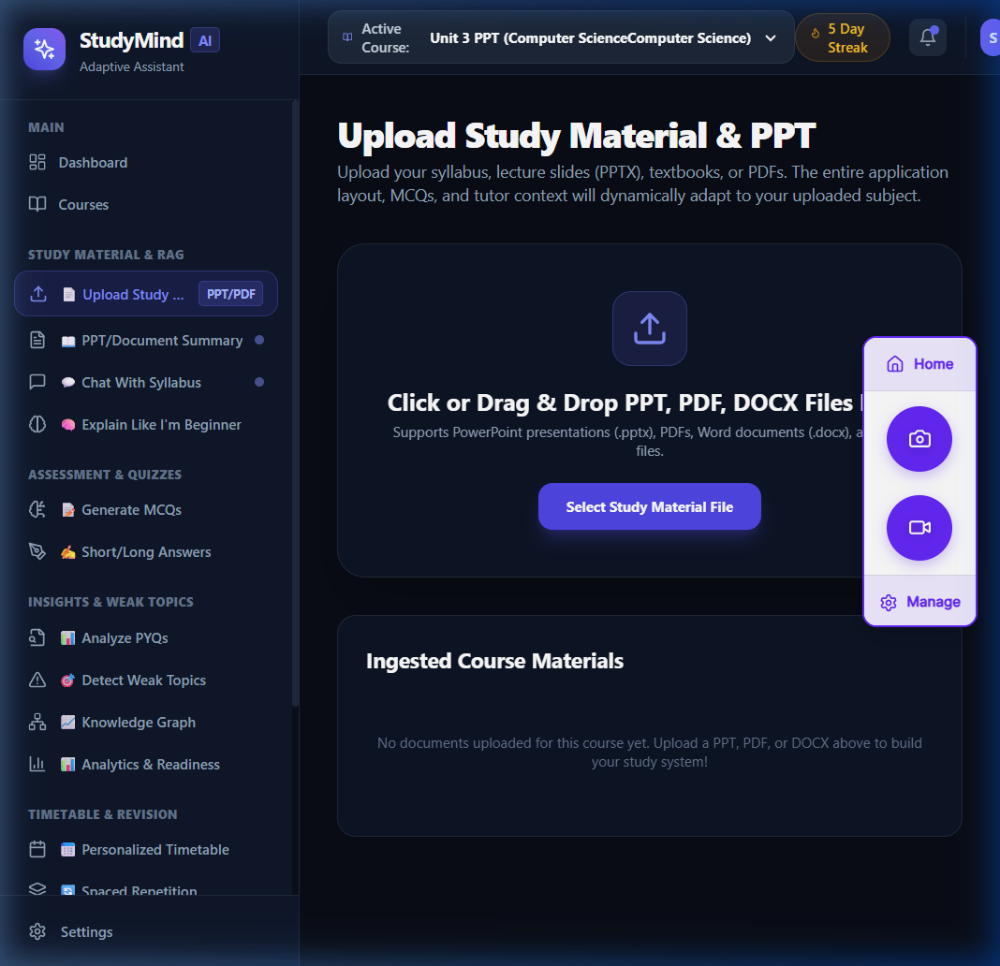
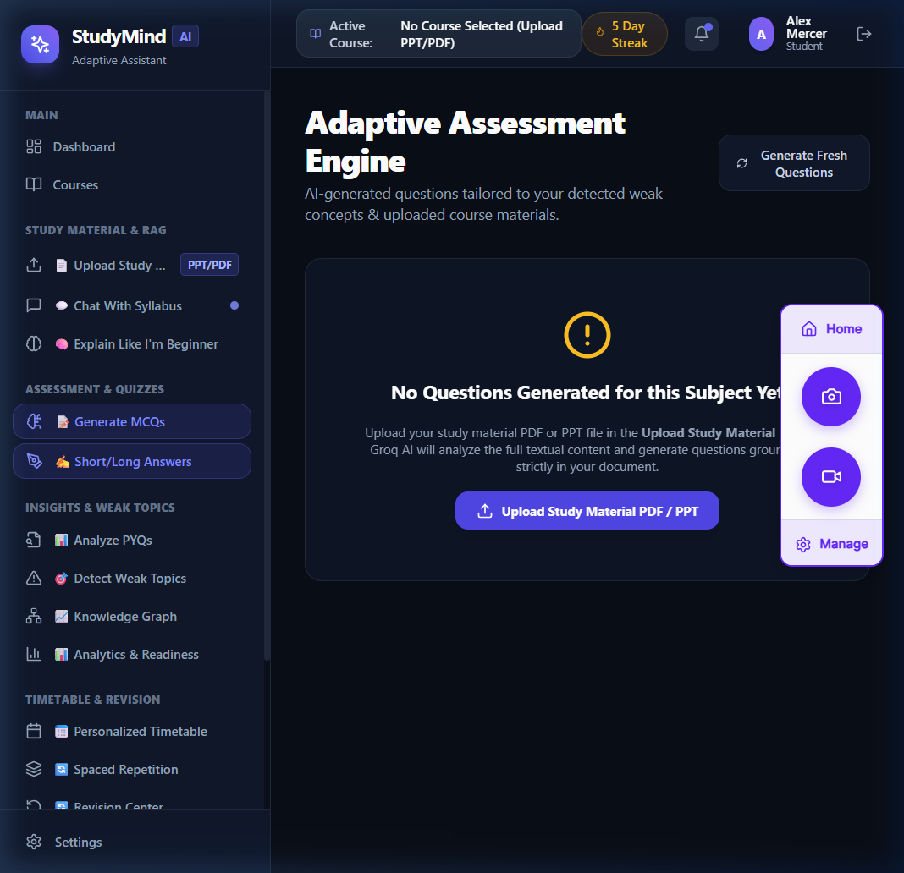

# 🎓 StudyMind AI — Adaptive AI-Powered Study Platform

> **Grounded RAG Architecture • Zero Hallucination Q&A • Slide & Page Citations • 10-Module Study Ecosystem**

StudyMind AI is an adaptive, AI-powered study platform designed to transform static course materials (PPTs, PDFs, lecture notes, and past year exam papers) into an interactive, personalized learning environment. Built on a Grounded Retrieval-Augmented Generation (RAG) pipeline, StudyMind AI restricts LLM responses strictly to your uploaded course documents, providing verified page-level source citations, diagnostic quizzes, automated weak topic tracking, and minute-by-minute study planning.

---

## 🖼️ User Interface Showcase

### 📊 Adaptive Student Dashboard
> Features the **Aurora AI** dark theme, adaptive subject pill, core 10-module hubs, mastery index growth tracking, and real-time revision alerts.


---

### 🔑 Authentication & Login
> Cosmic grid background with ambient glow, glassmorphism authentication card, and floating feature indicators.


---

### 📖 Grounded Document Summary & PDF Chapter Breakdown
> Instant section summaries, page citations, and PDF export functionality generated directly from uploaded PPTs/PDFs.


---

### 📝 Diagnostic Quiz & MCQ Generator
> Auto-generated diagnostic multiple-choice questions with answer keys and explanations grounded in uploaded course content.


---

## ⚡ Key Features & Core Modules

1. **📄 Document Ingestion & RAG Base**: Upload PPTs, PPTXs, PDFs, DOCXs, and TXTs. Extracts slide text and builds a 384-dimensional vector store index.
2. **🔎 Grounded RAG AI Tutor**: Multi-mode Q&A (*Beginner Analogy*, *Socratic Dialogue*, *Exam Prep*) with verified slide and page citations.
3. **📝 MCQ & Diagnostic Quiz Generator**: Automated generation of diagnostic questions directly from course slides.
4. **✍️ Semantic Descriptive Evaluator**: Semantic evaluation of short & long written conceptual answers.
5. **📊 PYQ & Exam Frequency Analyzer**: Extracts repeated historical exam questions, frequency metrics, and topic weightings.
6. **🎯 Weak Topic Detection & Vault**: Automatically captures recurring quiz errors and routes them to flashcards.
7. **📅 Personal Study Planner & 2-Hour Crash Mode**: Generates adaptive study schedules and minute-by-minute crash mode timetables.
8. **🔄 Spaced Repetition (SuperMemo SM-2)**: Algorithmically scheduled flashcard revision cycles for maximum long-term memory retention.
9. **🕸️ Interactive Knowledge Graph**: Visual node-link network mapping course concept hierarchies and prerequisite relationships.
10. **📈 Analytics & Exam Readiness Index**: Real-time 0-100% Exam Readiness score tracking student performance growth.

---

## 🏗️ System Architecture & Tech Stack

```
┌─────────────────────────────────────────────────────────────────────────┐
│                           NEXT.JS 14 FRONTEND                           │
│     (TypeScript • Tailwind CSS • Aurora AI Theme • Recharts • Lucide)     │
└────────────────────────────────────┬────────────────────────────────────┘
                                     │ REST API Requests
                                     ▼
┌─────────────────────────────────────────────────────────────────────────┐
│                             FASTAPI BACKEND                             │
│       (PyMuPDF • python-pptx • Sentence-Transformers • SQLite ORM)       │
└────────────────────────────────────┬────────────────────────────────────┘
                                     │ Grounded Vector Context
                                     ▼
┌─────────────────────────────────────────────────────────────────────────┐
│                          GROQ LLM CLOUD INFERENCE                       │
│                   (Llama-3 / GPT-OSS 20B LPUs Sub-Second)               │
└─────────────────────────────────────────────────────────────────────────┘
```

- **Frontend**: Next.js 14 (App Router), TypeScript, Vanilla CSS design tokens (Aurora AI Palette), Lucide React, Recharts.
- **Backend API**: Python FastAPI, SQLAlchemy ORM, SQLite Database, Pydantic validation schemas.
- **AI & RAG Engine**: Local `sentence-transformers` (`all-MiniLM-L6-v2`), PyMuPDF, python-pptx, Groq Cloud API SDK.

---

## 🚀 Quick Start (Local Setup)

### 1. Clone the Repository
```bash
git clone https://github.com/shivdev79/adaptive-study-ai.git
cd adaptive-study-ai
```

### 2. Backend Setup (FastAPI)
```bash
cd backend
python -m venv venv
# Windows:
venv\Scripts\activate
# Linux/macOS:
source venv/bin/activate

pip install -r requirements.txt
```

Create a `.env` file in the `backend/` directory:
```env
LLM_PROVIDER=groq
GROQ_API_KEY=your_groq_api_key_here
GROQ_MODEL=openai/gpt-oss-20b
DATABASE_URL=sqlite:///./studymind.db
```

Start the backend server:
```bash
uvicorn app.main:app --reload --port 8000
```
*API docs available at `http://localhost:8000/docs`*

### 3. Frontend Setup (Next.js)
```bash
cd ../frontend
npm install
npm run dev
```
*Open `http://localhost:3000` in your browser.*

---

## 🌐 Production Deployment Guide

- **Frontend Deployment (Vercel)**:
  - Connect your GitHub repository to Vercel (Root Directory: `frontend`).
  - Add Environment Variable: `NEXT_PUBLIC_API_BASE_URL=https://your-backend-domain.com/api`

- **Backend Deployment (Render / Railway)**:
  - Create a Web Service connected to `backend/`.
  - Build Command: `pip install -r requirements.txt`
  - Start Command: `uvicorn app.main:app --host 0.0.0.0 --port $PORT`
  - Add Environment Variable: `GROQ_API_KEY=your_groq_api_key`

---

## 📄 Project Presentation & Documentation

The repository includes the full project documentation and presentation deck script in Microsoft Word format:
- **Presentation Deck Document**: [`StudyMind_AI_Project_Presentation_Report.docx`](StudyMind_AI_Project_Presentation_Report.docx)

---

## 📜 License

Distributed under the MIT License. See `LICENSE` for more information.
